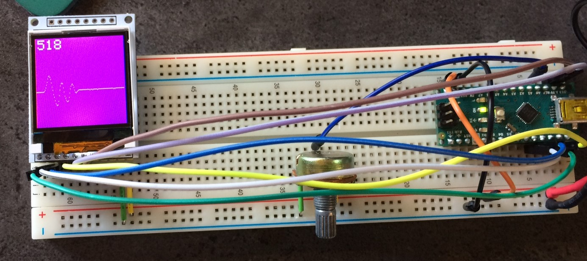

# basics-tftdisplay

Basics series: Small TFT display (XC4629 - ST7735 driver) hooked up to an Arduino Nano

Although I've written my own wrapper for the Adafruit class (since the XC4629 isn't completely standard), I've been unable to test it since PlatformIO upload to my Nano still isn't working and the Arduino IDE can't seem to locate some of the dependencies - even though they're used by the base libraries.

The XC-4629 is non-standard in a few significant ways. Next time I'm just going to buy direct from Adafruit and save the hassle! Firstly, they've named the pins... unusually. For no apparent reason. The datasheet however does explain how to hook it up to an Arduino Uno (same as Nano) which is basically just tying the pins up to the correct SPI pins. Secondly, it's not a standard size. It's only 128x128 pixels instead of the full 128x160 that most other TFTs with this chipset are. The base TFT class with Arduino therefore has the size wrong which makes some of the underlying functions a bit dodgy.

## References

* http://www.electronics-lab.com/project/using-st7735-1-8-color-tft-display-arduino/
* https://www.arduino.cc/en/Reference/TFTLibrary
* https://www.arduino.cc/en/Tutorial/TFTGraph
* https://www.arduino.cc/en/reference/SPI

